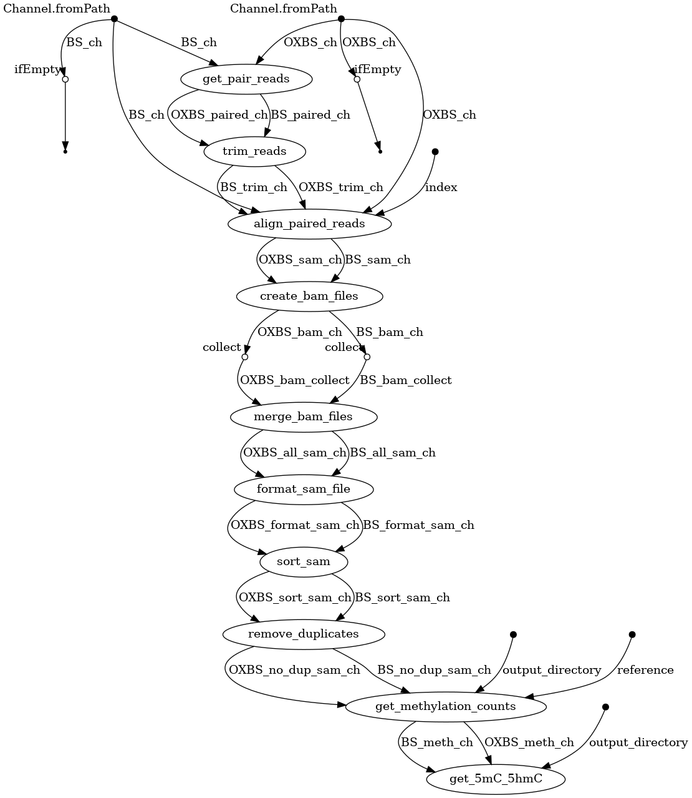

# BIOF 501A Term Project - MethOxFlow: Analyze Methylation and Hydroxymethylation from Oxidative Bisulfate and Bisulfate Sequencing 

### *By Andrew Galbraith*

--------------------

## Repository contents

### Directories

  + Data:  Contains Fastq files and Reference genome fasta file which serve as inputs 
        for the pipeline. Fastq_subset and Fastq_subset2 folders contain 3 and 5 small fastq files to test the pipeline on. BS and OXBS folders contain the BS and OXBS fastq data respectively. 
  
  + singularity: Singularity cache if attempting to run pipeline with singularity
        instead of conda (Not Recommended)
  
### Files

  + SRR13665293_pass.fastq: Contains read data for BS run
        
  + SRR13665293_pass.fastq: Contains read data for OXBS run
        
  + mm10.fa: Reference file for mouse genome

  + MethOxFlow.nf: Nextflow file which contains pipeline instructions; paramaters can 
        be altered to change pipeline inputs.

  + MethOxFlow.config: Configuration file for conda environment for nextflow pipeline. 
        Change conda environment path to your chosen environment location.

  + MethOXFlow_params.json: File to specify pipeline parameters
        
  + MethOxFlow_singularity.config: Configuration file for running nextflow pipeline    
        with singularity (Not Recommended).

  + flowchart.png: Representation of the overall workflow in SVG format. Viewable in
        web browser. 
        
  + MethOxFlow_Environment.yml: Contains dependencies used in this workflow. Used to
         build the conda environment.

---------------------

## Introduction

### Background and Rationale

Methylation of the fifth carbon in the cytosine base (5mC) is a DNA modification that is preserved during cell division and regulates gene expression through silencing promoters or enhancers (1,2). Specifically, 5mC can disrupt the binding of transcription factors or enhance repressor binding2. 5mC is a stable but dynamic epigenetic mark that occurs primarily in a CpG dinucleotide context through the covalent transfer of a methyl group by DNA methyltransferases (DNMTs) (1).  DNMT1 maintains 5mC during DNA replication whereas DNMT3A and DNMT3B aid in de novo methylation2. 5mC can either be lost passively through maintenance failure or it can be actively removed by ten-eleven translocation (TET) and thymine DNA glycosylase enzymes (TDG) (2,3). TET enzymes oxidize 5mC to form 5-hydroxymethylcytosine which is further chemically modified and ultimately cleaved by TDG, resulting in demethylation (2-4). Due to 5hmC leading to demethylation, its presence in gene bodies, promoters, and enhancers is linked with gene expression (5). Therefore, understanding both 5mC and 5hmC patterns in cells sheds light on why certain genes are expressed or silenced as well as which genes may be transitioning from one state to the other. For this reason, 5mC and 5hmC profiles can serve as biomarkers for different cancers and cell types (5-12). 
There are a variety of different methods for deriving 5mC and 5hmC profiles, including oxidative bisulfate (OxBS) and bisulfate sequencing (BS), DNA immunoprecipitation sequencing, and long read sequencing (13-15). This pipeline is centered around Illumina short-read OxBS and BS since it remains the most robust method to detect 5hmC at base-pair resolution (13). This method involves using bisulfate to convert unmodified cytosines to uracils as well as oxidation combined with bisulfate to convert unmodified cytosines and hydroxymethlated cytosines to uracils (13). To find 5hmC, the OxBS signal (5mC) is subtracted from the BS signal (5mC & 5hmC). While there are computational protocols to analyze both OxBS and BS data to find 5mC and 5hmC, there is no nextflow pipeline developed for this process (13). Implementing these protocols into a nextflow pipeline will therefore ease usage for those with less computational background. Further, a nextflow pipeline eases high-throughput analysis of OxBS and BS data and ensures high reproducibility. Further, following computational workflows may result in manual error which will be alleviated by a computational pipeline. The nextflow pipeline in this repository was developed mostly using the MethPipe workflow and is specifically designed to process and align OxBS and BS data in parallel (16). 

### Purpose

This pipeline aims to identify both 5mC and 5hmC profiles from BS and OxBS data. This enables differential analysis of 5mC and 5hmC as well as other downstream processes.

-------------------------

## Dataset

The dataset for this pipeline comes from Stoyanova et al. who investigated the role of hydroxymethylation in neuronal differentiation using Mus musculus brain cells (17, https://www.ncbi.nlm.nih.gov/bioproject/700864). SRR13665287 is OxBS data from Purkinje cells and SRR13665293 is BS data from Purjinke cells. This dataset was chosen as it was one of the only ones I could find with easily available OXBS and BS fastq data. Further, Mus musculus genome is slightly less large and complex in comparison to Homo sapiens making it better suited for pipeline testing.

### Pipeline Overview

The first few steps of the pipeline download the fastq data along with the Mus musculus reference genome in the case they are not already downloaded. The fastq data is then split into much smaller files to ease testing and parallization of steps. By using your own data or data from the fastq subsets, these steps can be ignored.

The primary ten steps of the pipeline:

1. get_pair_reads: convert each fastq file into a set of pairs based on paired-end reads
2. trim_reads: trim potential adaptor sequences from reads
3. align_paired_reads: align reads to reference using abismal
4. create_bam_files: convert aligned sam files to bam files
5. merge_bam_files: merge all bam files into one sam file each for OXBS and BS
6. format_sam_file: apply abismal format to sam files
7. sort_sam: sort sam files
8. remove_duplicates: remove potential duplicate reads from sam files
9. get_methylation_counts: get OXBS and BS signal from aligned sam files
10. get_5mC_5hmC: get 5mC and 5hmC based on OXBS and BS signals. Only uses chromosome 1 for efficiency puposes. 

Steps 9-10 are very slow and could not be made faster for testing as they attempt to write out 5mC and 5hmC signals for each potential methylation site in the human genome even if no reads map to the region. 




## Usage


### Installation

Installing this pipeline requires `conda`, `git`, and `nextflow`. Instructions for installing these
software can be found [here](https://docs.conda.io/projects/conda/en/latest/user-guide/install/index.html), [here](https://git-scm.com/book/en/v2/Getting-Started-Installing-Git) and [here](https://www.nextflow.io/docs/latest/getstarted.html) respectively. 

1. First, you can clone this repository by running the following command:

```
git clone https://github.com/andrewgalbraith21/MBB659_Pipeline.git
```
2. Next, navigate to the project directory:
```
cd MBB659_Pipeline
```
3. Create folder for pipeline output
```
mkdir Out
```
4. Configure the parameters of MethOxFlow in the MethOXFlow_params.json. Note, the reference file and fastq files are in the repository. If you do not have a reference file or reference index the pipeline will create them and export them to the path specified. Note, the pipeline is only capable of downloading the mus musculus reference genome in this case. Use the Fastq_subset2 data for reproducible results. 
```
{
    "reference": "<path_to_reference_file>",
    "reference_index": "<path_to_abismal_index_of_reference",
    "BS_fastq": "<path_to_BS_fastqs>/*fastq*",
    "OXBS_fastq": "<path_to_OXBS_fastqs>/*fastq*",
    "output_directory": "<output_directory_path>",
    "RandomRun": false,
    "TestFastqSize": 0
}
```
5. You can now run the nextflow pipeline. Note, the pipeline can also be run with singularity using the seperate config file but this is not recommended due to it taking very long to load the singularity images. 

### Running the Pipeline

Use the following command to run the pipeline:

```
nextflow run MethOxFlow.nf -c MethOxFlow.config -params-file MethOXFlow_params.json -resume
```

Note, the pipeline can also be run with singulairty using the seperate config file but this is not recommended due to it taking very long to load the singularity images. Also, methpipe currently does not have a biocontainer on quay.io:

```
nextflow run MethOxFlow.nf -c MethOxFlow_singularity.config -params-file MethOXFlow_params.json -resume
```


### Input Files

1. Fasta reference file for alignment (Will download Mus musculus genome if path to reference is empty)
2. Abismal index for reference (Pipeline will create one if you do not have one)
3. OXBS fastq files (Will download OXBS test dataset if path is empty)
4. BS fastq files (Will download BS test dataset if path is empty)

### Output Files

1. BS methylation counts file:
    Chromosome, Basepair Location, Strand, Site, Frequency, Reads
2. OXBS methylation counts file:
    Chromosome, Basepair Location, Strand, Site, Frequency, Reads
3. 5mC and 5hmC frequency file:
    Chromosome, Start, End, 5mC Frequency, 5hmC Frequency, Unmethylated Freqeuncy, Conflicts

There are also filtered methylation counts files which along with the 5mC and 5hmC frequency files only contain chromosome 1. This was done only for testing purposes to short cut runtime. For general purposes, remove this step. 

### Results

Results shown are for when the pipeline was run on "Data/fastq_subset2", "Data/fastq_subset" will have different results. The output methylation counts files will be mostly empty since only a small subset of the data was used. To find sites that actually have reads run the command: 

```
awk '$6 > 0' BS.meth
```

For the BS methylation count on the fastq_subset2 only about 14779 / 78962721 methylation sites on chromosome 1 have reads:

```
awk '$6 > 0' BS_filt.meth | wc -l
wc -l BS_filt.meth 
```

The 5mC_5hmC.bed file is also mostly empty on the fastq_subset2 run and filled with nan values. Only 161 / 78962721 sites have meaningful information and of these most (105) are unmethylated:

```
awk '!/nan/' 5mC_5hmC.bed | wc -l 
wc -l 5mC_5hmC.bed
awk '!/nan/' 5mC_5hmC.bed | awk '$6==1' |  wc -l
```


### Future directions

Future developments of the pipeline may include other alignment and methylation software such as Bismark (18). This will enable comparisons of different computational workflows to discover the most optimal process for OxBS and BS analysis. Further, downstream process such as differential 5mC and 5hmC analysis along with visualization could be added to the pipeline.

----------------------

## References

1.	Jin B, Li Y, Robertson KD. DNA methylation: superior or subordinate in the epigenetic hierarchy? Genes Cancer. 2011;2(6):607-17.
2.	Moore LD, Le T, Fan G. DNA methylation and its basic function. Neuropsychopharmacology. 2013;38(1):23-38.
3.	Onodera A, González-Avalos E, Lio CJ, Georges RO, Bellacosa A, Nakayama T, et al. Roles of TET and TDG in DNA demethylation in proliferating and non-proliferating immune cells. Genome Biol. 2021;22(1):186.
4.	Richa R, Sinha RP. Hydroxymethylation of DNA: an epigenetic marker. EXCLI J. 2014;13:592-610.
5.	Cui XL, Nie J, Ku J, Dougherty U, West-Szymanski DC, Collin F, et al. A human tissue map of 5-hydroxymethylcytosines exhibits tissue specificity through gene and enhancer modulation. Nat Commun. 2020;11(1):6161.
6.	Wang J, Su Y, Tian Y, Ding Y, Wang X. Characterization of DNA hydroxymethylation profile in cervical cancer. Artif Cells Nanomed Biotechnol. 2019;47(1):2706-14.
7.	Li W, Zhang X, Lu X, You L, Song Y, Luo Z, et al. 5-Hydroxymethylcytosine signatures in circulating cell-free DNA as diagnostic biomarkers for human cancers. Cell Res. 2017;27(10):1243-57.
8.	Tian X, Sun B, Chen C, Gao C, Zhang J, Lu X, et al. Circulating tumor DNA 5-hydroxymethylcytosine as a novel diagnostic biomarker for esophageal cancer. Cell Res. 2018;28(5):597-600.
9.	Cai J, Chen L, Zhang Z, Zhang X, Lu X, Liu W, et al. Genome-wide mapping of 5-hydroxymethylcytosines in circulating cell-free DNA as a non-invasive approach for early detection of hepatocellular carcinoma. Gut. 2019;68(12):2195-205.
10.	Chiu BC, Zhang Z, You Q, Zeng C, Stepniak E, Bracci PM, et al. Prognostic implications of 5-hydroxymethylcytosines from circulating cell-free DNA in diffuse large B-cell lymphoma. Blood Adv. 2019;3(19):2790-9.
11.	Applebaum MA, Barr EK, Karpus J, Nie J, Zhang Z, Armstrong AE, et al. 5-Hydroxymethylcytosine Profiles Are Prognostic of Outcome in Neuroblastoma and Reveal Transcriptional Networks That Correlate With Tumor Phenotype. JCO Precis Oncol. 2019;3.
12.	Li X, Liu Y, Salz T, Hansen KD, Feinberg A. Whole-genome analysis of the methylome and hydroxymethylome in normal and malignant lung and liver. Genome Res. 2016;26(12):1730-41.
13.	De Borre M, Branco MR. Oxidative Bisulfite Sequencing: An Experimental and Computational Protocol. Methods Mol Biol. 2021;2198:333-48.
14.	Lentini A, Lagerwall C, Vikingsson S, Mjoseng HK, Douvlataniotis K, Vogt H, et al. A reassessment of DNA-immunoprecipitation-based genomic profiling. Nat Methods. 2018;15(7):499-504.
15.	Liu Y, Cheng J, Siejka-Zielińska P, Weldon C, Roberts H, Lopopolo M, et al. Accurate targeted long-read DNA methylation and hydroxymethylation sequencing with TAPS. Genome Biol. 2020;21(1):54.
16.	Song Q, Decato B, Hong EE, Zhou M, Fang F, Qu J, et al. A reference methylome database and analysis pipeline to facilitate integrative and comparative epigenomics. PLoS One. 2013;8(12):e81148.
17. Stoyanova E, Riad M, Rao A, Heintz N. 5-Hydroxymethylcytosine-mediated active demethylation is required for mammalian neuronal differentiation and function. Elife. 2021;10.
18.	Krueger F, Andrews SR. Bismark: a flexible aligner and methylation caller for Bisulfite-Seq applications. Bioinformatics. 2011;27(11):1571-2.